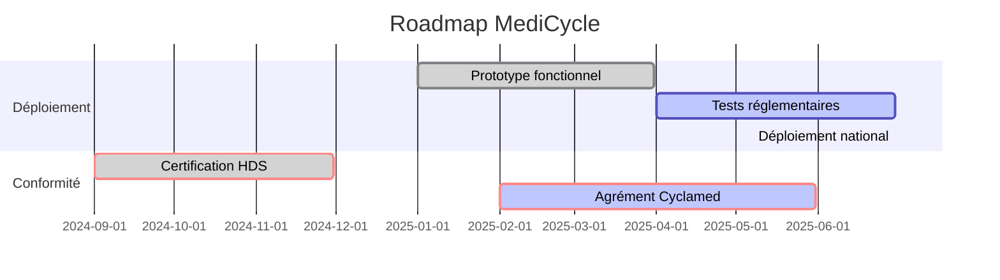

# 📄 Cahier des Charges Technique de MediCycle & Recipharma

## 1. 🌍 Contexte & Problématique
**Enjeux Majeurs :**
- 🗑️ **Surplus & Gaspillage :** 80% des ménages conservent des MNU, générant 4 000 tonnes de déchets annuels en France.
- 💰 **Coût Économique :** Entre 500 et 700 M€ de gaspillage chaque année en France.
- 🌱 **Impact Environnemental :** Contaminations écologiques significatives dues aux déchets non valorisés.
- 💊 **Marché Noir & Contrefaçons :** 15% des médicaments circulants sont falsifiés, un marché parallèle à 200 milliards de $.

### 2. 🚀 Solutions MediCycle & Recipharma
#### MediCycle : Pour les Professionnels de Santé
- **Blockchain Hyperledger :** 🌐 Traçabilité et sécurité des informations liées aux médicaments.
- **Borne IoT & Vision IA :** 🎥 Analyse des emballages via caméras connectées, détection des anomalies par IA.
- **IA pour Prédiction & Surveillance :** 📊 Détection des anomalies et optimisation des flux.

| Élément               | Détail Technique                                |
|-----------------------|-------------------------------------------------|
| **Blockchain**        | Hyperledger                                     |
| **Vision par IA**     | Analyse des emballages, IA pour anomalies       |
| **Borne IoT**         | Caméras connectées, systèmes anti-intrusion     |

#### Recipharma : Engagement Citoyen
- **Token RPA :** 🎟️ Récompense des dépôts avec un token unique.
- **Blockchain Ethereum :** 🔗 Authenticité des transactions et validation des médicaments.
- **Application Mobile :** 📱 Suivi des dépôts et échange de tokens.

## 3. 📸 Vision IA : Sécurité Visuelle & Détection des Anomalies

| Fonctionnalité                    | Description                                                                 |
|-----------------------------------|-----------------------------------------------------------------------------|
| **Détection Anomalies Visuelles** | Couleurs, logos, fautes d'orthographe, QR codes                             |
| **OCR**                           | Extraction texte imprimé, vérification contre base référentielle            |
| **Codes QR & Datamatrix**         | Décryptage et comparaison avec blockchain                                   |
| **Marquages de Sécurité**         | Analyse hologrammes, identification contrefaçons                            |

### 4. 🔐 Complémentarité Vision IA et Blockchain
- **Sécurité accrue :** 🛡️ Détection automatiques des fraudes visuelles et incohérences blockchain.
- **Traçabilité transparente :** 🔍 Authentification des médicaments par les professionnels et citoyens.
- **Réduction des contrefaçons :** 🚫 Isolation des médicaments non authentifiés ou incohérents.

## 5. 🌟 Impact & Résultats Attendues

| Domaine              | Objectifs et Résultats                                                                |
|----------------------|-----------------------------------------------------------------------------------------|
| **Écologique**       | Réduction des médicaments jetés (-30 % en 5 ans). Diminution des résidus contaminants. |
| **Social & Économique** | Confiance dans la chaîne de distribution (moins de contrefaçons). Participation citoyenne.|
| **Santé Publique**   | Identification fiable des contrefaçons. Moins de risques pour les patients.             |

## 6. 📅 Planning & Livrables (a définir WIP )

## 8. 💼 Stratégie Commerciale & Génération de Revenus

### 8.1. Modèle Économique
**Revenus principaux :**
- **Frais de Service :** Facturation des infrastructures de blockchain et IA aux pharmacies et laboratoires.
- **Vente de Données :** Analyse des données collectées (anonymisées) pour des études de marché et recherche.
- **Licences de Logiciels :** Offre SaaS pour la gestion des MNU par les collectivités territoriales et entreprises.
- **Programmes de Recyclage :** Subventions et partenariats avec les gouvernements et ONG pour la revalorisation des déchets.

### 8.2. Stratégie de Commercialisation
**Marché cible :**
- **B2B :** Pharmacies, laboratoires pharmaceutiques, distributeurs de médicaments, et centres de soins.
- **B2C :** Citoyens via l'application Recipharma pour engagement et éducation sur le recyclage des médicaments.

**Approches :**
- **Partenariats Stratégiques :** Collaboration avec Cyclamed et autres filières de santé pour intégration harmonieuse.

### 8.3. Avantages Concurrentiels
- **Technologie de Pointe :** Utilisation d'IA et blockchain pour une sécurité et une traçabilité optimisées.
- **Engagement Citoyen :** Récompenses avec tokens RPA pour une participation active au programme.
- **Conformité Réglementaire :** Adhésion stricte aux normes environnementales et de santé publique.

# 📄 Cahier des Charges Technique de MediCycle & Recipharma

## 1. 🌍 Contexte & Problématique
**Enjeux Majeurs :**
- 🗑️ **Surplus & Gaspillage :** 80% des ménages conservent des MNU, générant 4 000 tonnes de déchets annuels en France.
- 💰 **Coût Économique :** Entre 500 et 700 M€ de gaspillage chaque année en France.
- 🌱 **Impact Environnemental :** Contaminations écologiques significatives dues aux déchets non valorisés.
- 💊 **Marché Noir & Contrefaçons :** 15% des médicaments circulants sont falsifiés, un marché parallèle à 200 milliards de $.

### 2. 🚀 Solutions MediCycle & Recipharma
#### MediCycle : Pour les Professionnels de Santé
- **Blockchain Hyperledger :** 🌐 Traçabilité et sécurité des informations liées aux médicaments.
- **Borne IoT & Vision IA :** 🎥 Analyse des emballages via caméras connectées, détection des anomalies par IA.
- **IA pour Prédiction & Surveillance :** 📊 Détection des anomalies et optimisation des flux.

| Élément               | Détail Technique                                |
|-----------------------|-------------------------------------------------|
| **Blockchain**        | Hyperledger                                     |
| **Vision par IA**     | Analyse des emballages, IA pour anomalies       |
| **Borne IoT**         | Caméras connectées, systèmes anti-intrusion     |

#### Recipharma : Engagement Citoyen
- **Token RPA :** 🎟️ Récompense des dépôts avec un token unique.
- **Blockchain Ethereum :** 🔗 Authenticité des transactions et validation des médicaments.
- **Application Mobile :** 📱 Suivi des dépôts et échange de tokens.

## 3. 📸 Vision IA : Sécurité Visuelle & Détection des Anomalies

| Fonctionnalité                    | Description                                                                 |
|-----------------------------------|-----------------------------------------------------------------------------|
| **Détection Anomalies Visuelles** | Couleurs, logos, fautes d'orthographe, QR codes                             |
| **OCR**                           | Extraction texte imprimé, vérification contre base référentielle            |
| **Codes QR & Datamatrix**         | Décryptage et comparaison avec blockchain                                   |
| **Marquages de Sécurité**         | Analyse hologrammes, identification contrefaçons                            |

### 4. 🔐 Complémentarité Vision IA et Blockchain
- **Sécurité accrue :** 🛡️ Détection automatiques des fraudes visuelles et incohérences blockchain.
- **Traçabilité transparente :** 🔍 Authentification des médicaments par les professionnels et citoyens.
- **Réduction des contrefaçons :** 🚫 Isolation des médicaments non authentifiés ou incohérents.

## 5. 🌟 Impact & Résultats Attendues

| Domaine              | Objectifs et Résultats                                                                |
|----------------------|-----------------------------------------------------------------------------------------|
| **Écologique**       | Réduction des médicaments jetés (-30 % en 5 ans). Diminution des résidus contaminants. |
| **Social & Économique** | Confiance dans la chaîne de distribution (moins de contrefaçons). Participation citoyenne.|
| **Santé Publique**   | Identification fiable des contrefaçons. Moins de risques pour les patients.             |

## 6. 📅 Planning & Livrables

| Phase                        | Début       | Fin         | Statut       |
|------------------------------|-------------|-------------|--------------|
| Prototype fonctionnel        | 2025-01-01  | 2025-03-31  | Terminé      |
| Tests réglementaires         | 2025-04-01  | 2025-06-30  | En cours     |
| Déploiement national         | Après tests | 12 mois     | À venir      |
| Certification HDS            | 2024-09-01  | 2024-11-30  | Terminé      |
| Agrément Cyclamed            | 2025-02-01  | 2025-05-31  | En cours     |

## Conclusion
Grâce à l'intégration des technologies de vision IA et blockchain, MediCycle et Recipharma modernisent la gestion des MNU en assurant une sécurité et une traçabilité optimales tout en engageant les citoyens pour une chaîne écoresponsable.
